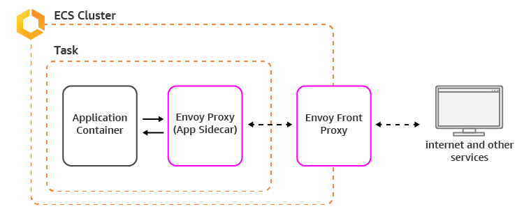
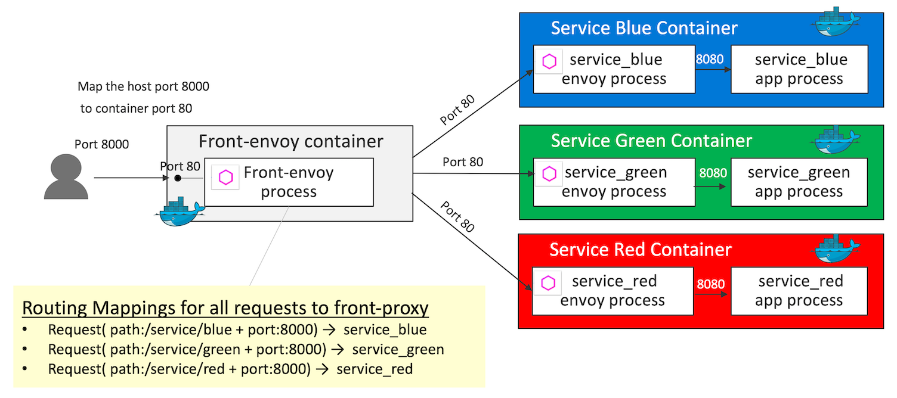

# COSE451-ASU chat client

This application aims the modern chat application using Vue.js and gRPC.
Here's a screenshot below:


## Architecture
### Frontend Proxy


cf. Backend Proxy


## Technology

This app uses:
* [gRPC](https://github.com/grpc/grpc-web)
* [Vuejs](https://vuejs.org/)
* [protobuf](https://developers.google.com/protocol-buffers)
* [Envoy](https://www.envoyproxy.io/)

## Running the demo
To run the demo follow these steps:

> First of all, install and configure `chat-server`!
1. Get TLS keys from [chat_server](https://github.com/cose451-asu/chat-server)
2. Follow the instruction to support TLS keys
3. [Install Envoy](https://www.envoyproxy.io/) for frontend proxy(See https://github.com/grpc/grpc-web/issues/522) 
4. [Install protobuf](https://developers.google.com/protocol-buffers) to compile .proto files
5. Download the repository by running `git clone https://github.com/cose451-asu/chat-client.git`
6. Run `npm install` to install all the project's dependencies
7.  Create a `.env` file with the root folder of the project and paste the following content in it:

```bash
#Should be the destination url+port
VUE_APP_URL=https://localhost:9001
```
8. Replace `VUE_APP_URL`, with your proper server destination
9. Run `npm run proto` 
10. (Optional) due to the issues belong `grpc-web`'s convention. It is recommended to disable the lint options in *.proto files. Run `npm run protofix` to execute `proto_fix.sh`. 
11. Run `npm run serve` to start the application and navigate to `http://localhost:8080` to view the app

## TODO
- [ ] TBD